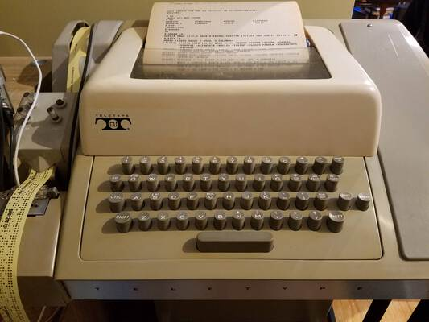
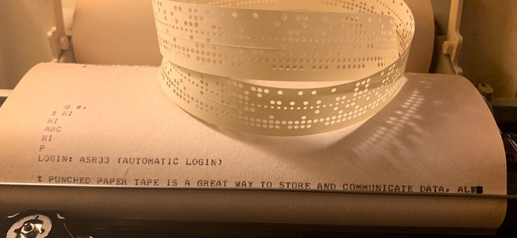
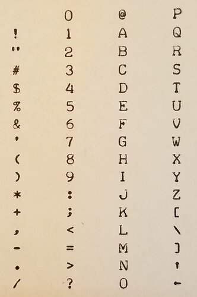
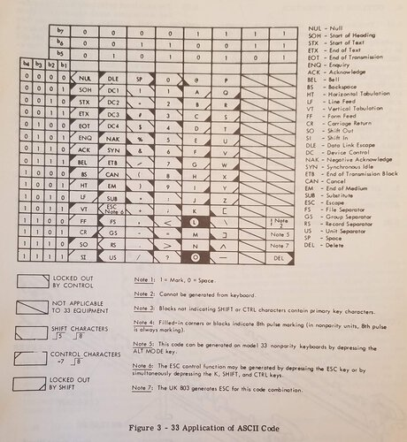
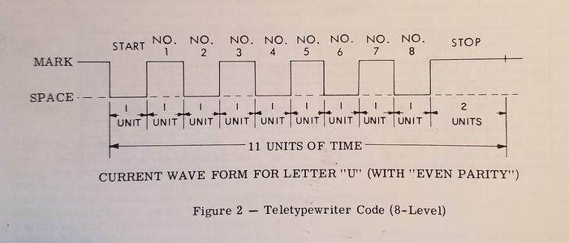

# Teletype Model 33 ASR

The [Teletype Model 33](https://en.wikipedia.org/wiki/Teletype_Model_33) was a very successful [computer terminal](https://en.wikipedia.org/wiki/Computer_terminal) in the late 1960s and 1970s.  It has an important historical role in several innovations, including the [ASCII  character set](https://en.wikipedia.org/wiki/ASCII) and the [development of Unix](https://homepage.cs.uri.edu/~thenry/resources/unix_art/ch02s01.html) and [BASIC](http://dtss.dartmouth.edu/).

### Some Background: ASCII, Unix and the ASR33

The history of the _teletypewriter_ – mechanical devices for digital communication – spans [from the earliest digital communications to global news and messaging networks](http://www.samhallas.co.uk/repository/telegraph/teletype_story.pdf).

In the early 1960s, the teletypewriter proved to be an ideal [interface](https://youtu.be/sjnmcKVnLi0?t=301) for the first time-sharing computer systems such as [CTSS](http://people.csail.mit.edu/saltzer/CTSS/CTSS-Documents/CTSS_ProgrammersGuide_1966.pdf).  People side-by-side or in different locations, each operating a terminal, could simultaneously work at the same computer, coordinate their activities, and even communicate with each other!  Increasingly, the larger general-purpose computers became connected by networks too.  Way before Wifi, before the [LAN](https://en.wikipedia.org/wiki/Local_area_network#History).

With the affordable Model 33 Teletype, *interactive terminals* became the standard UI for _minicomputers_ such as the [DEC PDP-7](http://www.bitsavers.org/pdf/dec/pdp7/F-77A_pdp7maint_1966.pdf), [PDP-8](https://www.computerhistory.org/revolution/minicomputers/11/331) and [PDP-11](https://dave.cheney.net/2017/12/04/what-have-we-learned-from-the-pdp-11), and as consoles for the first generation of _personal computers_ including the [Altair 8800](https://en.wikipedia.org/wiki/Altair_8800).

 

Hard-copy (printing) terminals were superseded in the 70s by the "glass TTY" (terminals like the [DataPoint 3300](https://en.wikipedia.org/wiki/Datapoint_3300) and [ADM-3A]()) and increasingly smart video terminals that had nice fonts, even color and graphics.  These had obvious advantages in flexibility, performance, convenience and eventually in cost. So the Teletype machinery became obsolete, but its data formats (8-bit serial data, ASCII text) and the central expectations of what a terminal could do (interactive input and output) are still baked into every modern operating system.  In this sense the Teletype is "compatible".  PC-compatible, Linux-compatible, Android-compatible, Internet-compatible, because it's their foundational I/O device. 

#### Terminal
A terminal consists of __data input__ and __data display__, connected to a computer system.   The teletype has a keyboard for input, and a printer for display.  The printer prints 72 characters per line on continuous-roll paper, and includes a bell (so that a typist can tell when nearing the end of a line, but also for notification).

_oops, no word-wrap_

#### Paper Tape
In the "ASR" (Automatic Send-Receive) Teletype models there are two additional I/O devices: a paper-tape reader for input, and a paper-tape punch for output.  [Punched paper tape](https://en.wikipedia.org/wiki/Punched_tape) is a great way to store and communicate data, although it's limited in density (10 characters per inch, or 2.66 kilometers per megabyte), slow (the Teletype can read/write at 10 bytes per second), and tears quite easily.

The reader is mechanical, which is pretty cool.  I don't understand it yet.

_8-level paper tape (here showing ASCII with no parity, so the 8th bit is unset)_

#### ASCII
The keyboard and printer use ASCII, which is a 7-bit character encoding [standardized in 1963](http://citeseerx.ist.psu.edu/viewdoc/download?doi=10.1.1.96.678&rep=rep1&type=pdf), with numbers, upper-case letters (no lowercase!), punctuation, and several _control characters_.  (Some of the punctuation is [unusual](https://twitter.com/33asr/status/1052956789086531584)).

An eighth data bit can be used for [parity](https://en.wikipedia.org/wiki/Parity_bit), depending on the exact model of Teletype keyboard.

The tape punch and reader use all 8 bits, so can be used to read and store binary data (bytes). 

 

_Pretty typewheel, and comprehensive man pages (in the three-ring binder)_

#### Serial Data Mechanism
The data connection is a serial [current loop](https://en.wikipedia.org/wiki/Digital_current_loop_interface) (two-wire system).  There are two independent current loops, one for "send" and another for "receive".  They are quite reliable over moderate distances (up to several kilometers), which is handy when your nearest computer is a long way away.

On the "send" (keyboard and tape reader), the teletype doesn't have any electronics!  The 8-bit parallel connections go to a [distributor](https://www.youtube.com/watch?v=E0T1zj1MuPc) with a rotating brush (driven by a motor and clutch) that make or break the current loop for each bit in turn.  It's quite complicated and completely mechanical, but well-documented.  The keyboard "latches", when a key is pressed it stays down (making the wires [connect for each bit](https://www.youtube.com/watch?v=HtnFg0m41zk)), until the distributor has rotated to send the bits down the wire.  Then the next key can be pressed, and then latched until sent, and so on.

On the "receive" side (printer and tape punch), the serial current loop is distributed to a set of solenoids that lift [codebars](https://www.youtube.com/watch?v=d-VPz2ZT0CQ) to move the print head and punch pins.  There's some electronics here: a simple solid-state amplifier from the 20mA loop to 500mA to drive the solenoids.  Again, the mechanics are quite complicated, with the print head rotating for each incoming character, and also the carriage moving forward, and the "CR" code (carriage return) triggering the release of the spring that returns it.  Oil is required, and accounts for the vintage smell.  Its [vintage sound](https://www.youtube.com/watch?v=AVMpcS4BUoY) is quite something, too.

PCs generally used the [RS-232](https://en.wikipedia.org/wiki/RS-232) serial interface standard, which is based on voltage rather than current.  But this has itself been superseded by [USB](https://www.electronics-notes.com/articles/connectivity/usb-universal-serial-bus/standards.php).

The Model 33's data format – 1 start bit, 8 data bits and 2 stop bits – is simple, but obsolete.  By USB standards, a teletype is ridiculously slow; very few hardware interfaces (UARTs) can be found nowadays that will connect at the blazing speed of 10 characters per second (110 bits per second).  They're all in the megabit, gigabit, whatever.  But my speed is slow enough to simulate, even if the hardware has left us behind.

---

# This Project

In the early 1980s, I was lucky to attend a high-school that had a Teletype connected to the [PR1ME](https://en.wikipedia.org/wiki/Prime_Computer) cluster at the University of Surrey.  As user SCH008, this was my early gateway to the world of networked computers.  It's amazingly fun to revisit some of those experiences.  I've worked in DOS, Windows, OS/2, linux, macOS, iOS, Android, and more besides, and it looks like little Linux machines are everywhere.

Whether in your hand or in cloud, modern machines are exponentially larger and faster than in those days.   But although the Teletype hardware and [original Unix software](http://www.lemis.com/grog/Documentation/Lions/index.php) have been superseded by 50 years' of layered improvement, the hard-copy Model 33 terminal is [still](https://github.com/openbsd/src/blob/master/etc/gettytab#L98) the canonical `/dev/tty`.

So, is a teletypewriter terminal still **usable**, or even **useful**, today?

This project is an ongoing exploration of how to connect its descendents' operators to the Internet.  How to use the Teletype interactively, for real, as a terminal to modern networks and computers and everything they can do.  What that tactile, interactive experience is _like_ for the people and groups that play with it (noisily in the room).  The command-line is waiting, more powerful by miles, and its rails were built for these wheels.  I don't think it'll go out of date just yet.

In this repo you'll find documentation of software and hardware in the process, with tools, mostly Unix-ish software in Python for the Raspberry Pi.  This involves making the Unix commandline and essential software usable with a hard-copy terminal where "carriage return" takes hundreds of milliseconds, with no scroll-back, no "erase" or "clear", no back-space, no lower-case, no color, no graphics, and no cursor.  But the paper printout and the punched tape are pretty useful, and tactile, and (yup) fun.

There's information about the physical machine and the electronic connection (current-loop serial to USB).  The way I approached this uses an [Arduino microcontroller](teensytty/teensytty.ino) to handle the slow serial data stream and make the terminal appear halfway "modern" (mostly things that have just become obsolete and removed from stty, such as delays for the hardware carriage return and line feed, converting to lower case) and even "smart" (ANSI escape codes that can be used by Unix apps).  I think that's the best way today; the [Teensy processor](https://www.pjrc.com/store/teensy32.html) is just right for this job.  

With USB the terminal can connect to just about anything, including a Mac, but my main setup is with a Raspberry Pi built into the pedestal.  This runs debian linux (raspbian stretch), and it's a great platform for working on an archaic terminal.  It can boot up and get to the login prompt, and log in just automatically, with `getty`.  That sets up the `stty` (nothing much to do, there) and the way escape codes are handled (terminfo).  The escape codes are pretty involved, I guess, and need more doc than [the source code](teensytty/ansi_escape.h).

The operator is in a room with others, and should certainly be playing with the terminal's distinctive hardware capabilities, as well as the things it can connect to.
* Connecting to today's information utilities, with apps and notifications,
* Connecting to vintage systems and simulations,
* Lots of fun with printing and paper tape.  Ribbons, streamers, patterns, bookmarks, greetings cards, framed pictures, the works.  If you want me to print something and send it to you, [there's an Etsy store!](https://www.etsy.com/shop/asr33).  Not much there yet, but talk to me on Twitter and whatever.  It'll get more structured eventually.
 
Follow along – and dive in please! – [here on GitHub](https://github.com/hughpyle/ASR33), and [@33asr on Twitter](https://twitter.com/33asr).

---

* Initial project notes: [pdf](tty-usb.pdf) and [pptx](tty-usb.pptx) Mostly about the electronics hardware.

* **[pix](pix)**: 
Photos and other pictures.

* **[hardware](hardware)**: 
Hardware for 20mA current loop send and receive.

* **[teensytty](teensytty)**:
Using a Teensy microcontroller for the ASR33-to-USB interface.

* **[osx](osx)**:
Setting up a getty on macOS.

* **[rpi](rpi)**:
Setting up a getty on Raspberry Pi (raspbian).

* **[bin](bin)**:
Some command-line utilities for the tty user.  Put this on your PATH.  There's a lot of fun stuff there including scripts to print [words on papertape](https://twitter.com/33asr/status/1074432596728262656), connect to [LambdaMoo](https://twitter.com/33asr/status/1078698114003943425), print [emoji](https://twitter.com/33asr/status/1046930898321645568), play [zork](https://github.com/hughpyle/ASR33/blob/master/bin/profile), connect to bbs, and more. 

* **[asciiart](asciiart)**:
Using the unique features of a hardcopy terminal, including _overstrike_.  Not just emoji, but Real Art of a sort.  Pictures and drawings and logos and photos.  Framed, and available online [in my Etsy store](https://www.etsy.com/shop/asr33) eventually.

* **[cups](cups)**:
Using [CUPS](https://en.wikipedia.org/wiki/CUPS) to make the Teletype appear as a network printer.  That's nice if you want to print from the laptop, but also because it's a message queue.  The print queue can take things from online services, like twitter and the news and SMS, who knows, WhatsApp or something.  But the printing should happen in background, only when the operator isn't in the middle of something else.  Work in progress.

* **[other_material](other_material)**:
Related source documentation and reference material.

The contents of this project are published under the [MIT license](LICENSE), let me know what you do with it!

---

I'm indebted to Wayne Durkee for bringing this machine back to life; Dave Tumey for recreated parts; to many Greenkeys list members and others for their inspiration and vast expertise.  And my wife plays along and indulges this stuff, for which I'm very happy.
