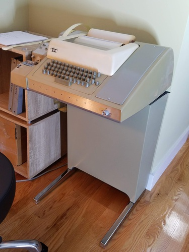

# This Project

In the early 1980s, I was lucky to attend a high-school that had a Teletype connected to the [PR1ME](https://en.wikipedia.org/wiki/Prime_Computer) cluster at the University of Surrey.  As user SCH008, this was my early gateway to the world of networked computers.  It's amazingly fun to revisit some of those experiences.  I've worked in DOS, Windows, OS/2, linux, macOS, iOS, Android, and more besides, and it looks like little Linux machines are everywhere.

Whether in your hand or in cloud, modern machines are exponentially larger and faster than in those days.   But although the Teletype hardware and original [Unix software](http://www.lemis.com/grog/Documentation/Lions/index.php) have been superseded by 50 years' of layered improvement, the hard-copy Model 33 terminal is [still](https://github.com/openbsd/src/blob/master/etc/gettytab#L98) the canonical `/dev/tty`.

So, is a teletypewriter terminal still **usable**, or even **useful**, today?

## Exploring the Hardware User Interface
This project is an ongoing exploration of how to connect its descendents' operators to the Internet.  How to use the Teletype interactively, for real, as a terminal to modern networks and computers and everything they can do.  What that tactile experience is _like_ for the people and groups that play with it (noisily in the room).  The command-line shell is waiting (mostly `bash`, not [Primos CPL](https://yagi.h-net.org/prime_manuals/prirun_scans/CPL%20Users%20Guide%20Rev%2021%20DOC4302-3LA%201987.pdf)), more powerful than ever, and its rails were built for these wheels.  I don't think it'll go out of date just yet.

In this repo you'll find documentation of software and hardware in the process, with tools, mostly Unix-ish software in Python for the Raspberry Pi.  This involves making the Unix commandline and essential software usable with a hard-copy terminal where "carriage return" takes hundreds of milliseconds, with no scroll-back, no "erase" or "clear", no back-space, no lower-case, no color, no graphics, and no cursor.  But the paper printout and the punched tape are pretty useful, and tactile, and (yup) fun.

There's information about the physical machine and the electronic connection (current-loop serial to USB).  The way I approached this uses an [Arduino microcontroller](../firmware/README.md) to handle the slow serial data stream and make the terminal appear halfway "modern" (mostly things that have just become obsolete and removed from stty: delays for the hardware carriage return and line feed, converting to lower case) and even "smart" (ANSI escape codes that can be used by Unix apps).  I think that's the best way today; the [Teensy processor](https://www.pjrc.com/store/teensy32.html) is just right for this job.  

With USB the terminal can connect to just about anything, including a PC or a Mac or a phone, but my main setup is with a Raspberry Pi built into the pedestal.  This runs debian linux (raspbian stretch), and it's a great platform for working on an archaic terminal.  It can boot up and get to the login prompt, and log in just automatically, with `getty`.  That sets up the `stty` (nothing much to do, there) and the way escape codes are handled (terminfo).  The escape codes are pretty involved, I guess, and need more doc than [the source code](../firmware/ansi_escape.h).

The operator is in a room with others, and should certainly be playing with the terminal's distinctive hardware capabilities, as well as the things it can connect to.
* Connecting to today's information utilities, with apps and notifications,
* Connecting to vintage systems and simulations,
* Lots of fun with printing and paper tape.  Ribbons, streamers, patterns, bookmarks, greetings cards, framed pictures, the works.  If you want me to print something and send it to you, [there's an Etsy store!](https://www.etsy.com/shop/asr33).  Not much there yet, but talk to me on Twitter and whatever.  It'll get more structured eventually.

---

I'm indebted to Wayne Durkee for bringing this machine back to life; Dave Tumey for recreated parts; to many Greenkeys list members and others for their inspiration and vast expertise.  And my wife plays along and indulges this stuff, for which I'm very happy.
