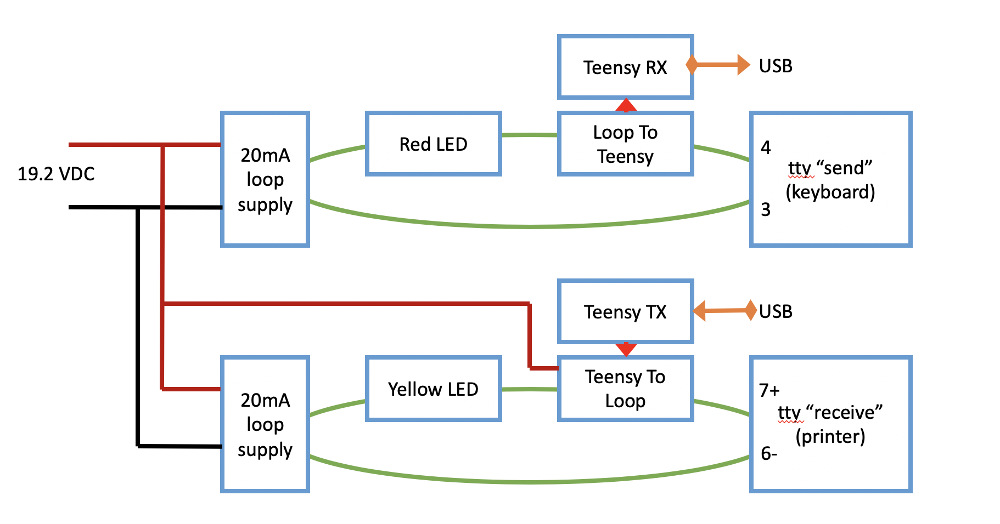

# Interface Hardware

The Teletype data interface is a serial data connection using 20mA current loop.

Connecting this to modern computers requires some hardware.  There are a few options:
* Current loop to RS-232 serial.  This can be done with quite simple electronics, and there are various commercially
available adapters.  One very neat option is Mike Douglas' [RS-232 Adapter](http://deramp.com/tty_adapter.html) that
plugs right into the back of the Teletype.
    * Most computers nowadays don't have RS-232 ports, so you'll also need
      a RS232-to-USB adapter.
    * You could even go RS232-to-Bluetooth.
* Eric Volpe's [USB converter](http://heepy.net/index.php/USB-teletype), which can also work with the 60mA loop on 5-level Teletypes,
* Build your own USB converter.

---

I built an interface from scratch.  It's a hobbyist build, not intended to be commercially replicable.  A very cool way to learn about current-loop interfaces nevertheless.

Project notes and pictures: [PDF](./tty-usb.pdf) and [PowerPoint](tty-usb.pptx).

The key features are:

* 20mA current loop @ 110 baud, interface to USB Serial.  The USB stuff is done with a Teensy microcontroller.
* Duplex operation, with separate transmit and receive loops.
* The loops are active (integrated current source), since the ASR33 is passive.
* Monitor loop activity with LEDs.
* Some character translation and processing is done in [Teensy firmware](../firmware/).

Additional information:

* [SPICE diagrams](./ltspice/) for the current-loop interface.
* [Older pictures](./v1_2015) from a discarded first build.

